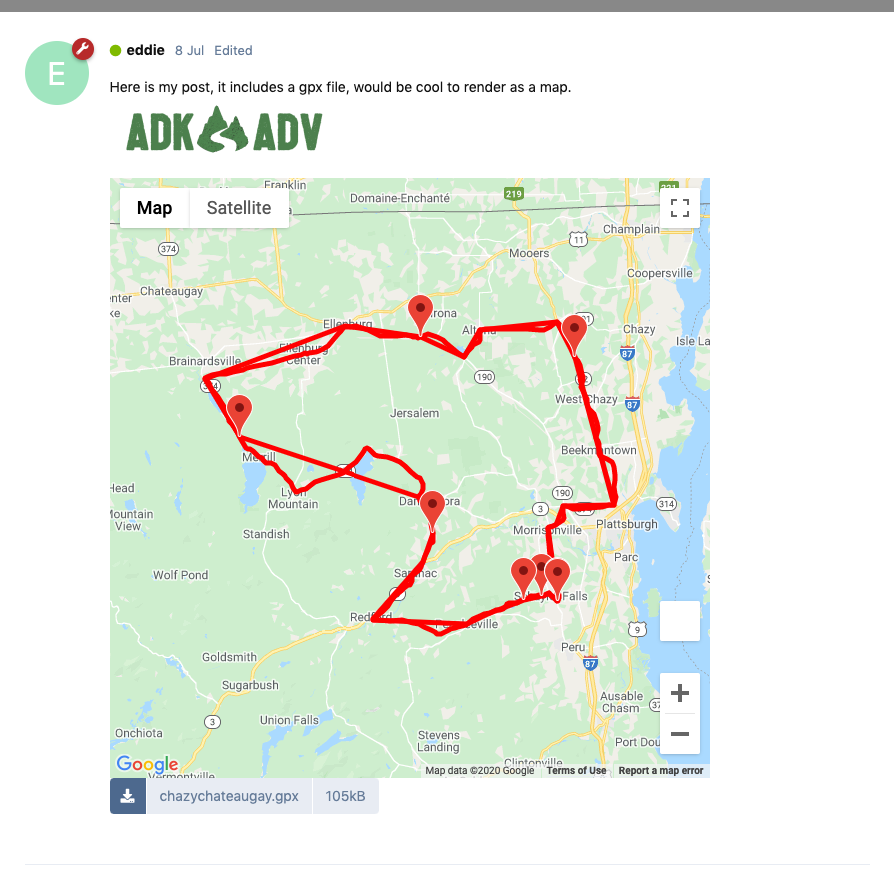
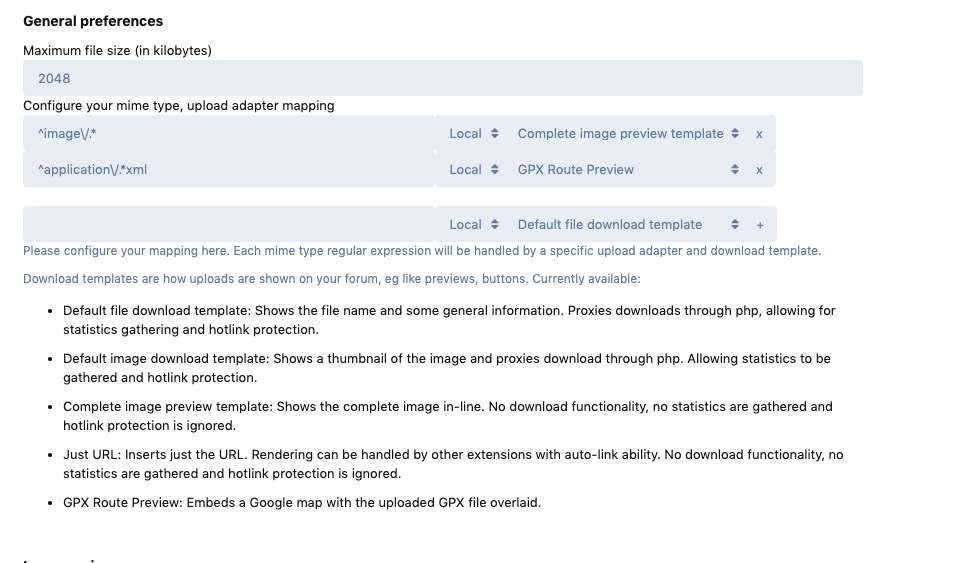

# GPX Preview

 

A [Flarum](http://flarum.org) extension. 
Adds GPS Route preview 

** Requires FoF/Upload **

## Installing

`composer require webbinaro/gpx-preview`

Configure FoF/Uploads to add the new GPX Template for `^application/gpx+xml` files.

